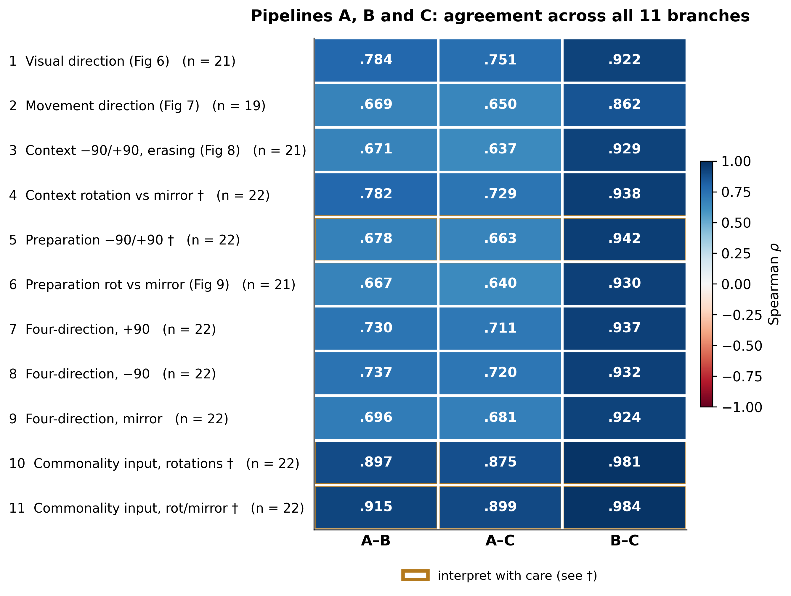
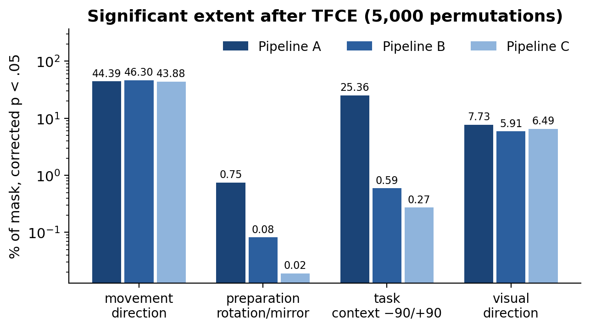

# Decoding the brain, or decoding the pipeline?

Supporting material for a poster at the 2026 Taiwan Open Brain Science Workshop.

We re-analysed one open fMRI dataset through several independent pipelines and asked which
conclusions move when the pipeline moves.

**[Read the results as an interactive page &rarr;](https://lepus071.github.io/ds004562-pipeline-multiverse/)**

This repository holds the tables behind that page and behind the poster.

**Dataset.** OpenNeuro [ds004562](https://openneuro.org/datasets/ds004562), from
Song, Y., Shin, W., Kim, P., & Jeong, J. (2023). *Neural representations for multi-context
visuomotor adaptation and the impact of common representation on multi-task performance.*
Frontiers in Human Neuroscience, 17, 1221944.
[doi:10.3389/fnhum.2023.1221944](https://doi.org/10.3389/fnhum.2023.1221944)

Participants (n = 22) erased a line with a joystick while the cursor was rotated by −90°, +90°,
or mirrored. Decoding asks where the pattern distinguishes the seen direction, the hand
direction, or the rule in force.

## The pipelines

| | What changes | Toolchain |
| --- | --- | --- |
| **A** | the authors' own toolchain | SPM12 / CONN / ART, SPM GLM, The Decoding Toolbox |
| **B** | preprocessing swapped | fMRIPrep / FastSurfer, SPM GLM, TDT |
| **C** | downstream software swapped as well | fMRIPrep, Nilearn GLM, scikit-learn linear SVC |
| **D** | an independent laboratory's own analysis | *withheld pending their consent to publish — see below* |

A, B and C implement the original decoding design: searchlight of 9 mm radius, linear SVM, train
in one context and test in another, whole blocks held out, across eleven analysis branches.

## How agreement is measured

- Spearman rho between two group accuracy maps, voxel by voxel, inside one frozen mask of
  158,156 voxels (79 × 95 × 79, 2 mm, 8 mm smoothing), identical for every pair.
- No thresholding, and ranks rather than raw values, so the pipelines' different accuracy scales
  cannot drive the result.
- Reported twice: between group maps, and within each participant and then averaged.
- Significance is computed separately: TFCE, 5,000 permutations, one-sample t across
  participants, the same mask for every pipeline.

## What we found

The ordering is identical in all eleven branches:

| Pair | What differs | Group rho |
| --- | --- | --- |
| B–C | downstream software only | .862 to .984 |
| A–B | preprocessing only | .667 to .915 |
| A–C | both | .637 to .899 |

**Preprocessing is the tool that matters.** Swapping it costs about a quarter of a rho. The
downstream implementation acts on a second, smaller axis: pipeline C decoded 0.2 to 1.5 accuracy
points below B despite identical inputs, a level shift rather than a spatial rearrangement.

Within participants the same pairs fall to .565 to .919, so a group map flatters every comparison
by .13 to .19.

**Thresholded conclusions are far more fragile than the maps they come from.** For task context,
pipeline A finds 25.4 % of the mask significant and pipeline B 0.59 %, with nothing but
preprocessing between them — while the two unthresholded maps still agree at .67. Visual
direction, by contrast, reproduces cleanly: 7.7 %, 5.9 % and 6.5 %.

## Files

| Path | What it holds |
| --- | --- |
| `tables/persubject_rho_abc.tsv` | one row per participant, branch and pipeline pair |
| `tables/persubject_summary_abc.tsv` | mean, sd, range and group rho per branch and pair |
| `tables/tfce_extent_abc.tsv` | significant voxel count, percentage of mask, and peak per pipeline and branch |
| `figures/agreement_matrix_abc.png` | the eleven-branch agreement matrix |
| `figures/tfce_extent_abc.png` | significant extent per branch, log scale |

## The fourth pipeline

A second laboratory analysed the same dataset independently, with a different cross-validation
scheme and a different label construction as well as different tools. Their maps and the
agreement numbers that involve them are **not included here**, and will be added only if they
agree to publication. The poster reports them with their permission.

## Citing

If you use these tables, please cite the original dataset and paper above. This re-analysis is
not a publication; treat it as workshop material.

## Contact

Ching-Yi Li — lepus071@gmail.com
Erik Chih-hung Chang — audachang@g.ncu.edu.tw
Institute of Cognitive Neuroscience, National Central University
